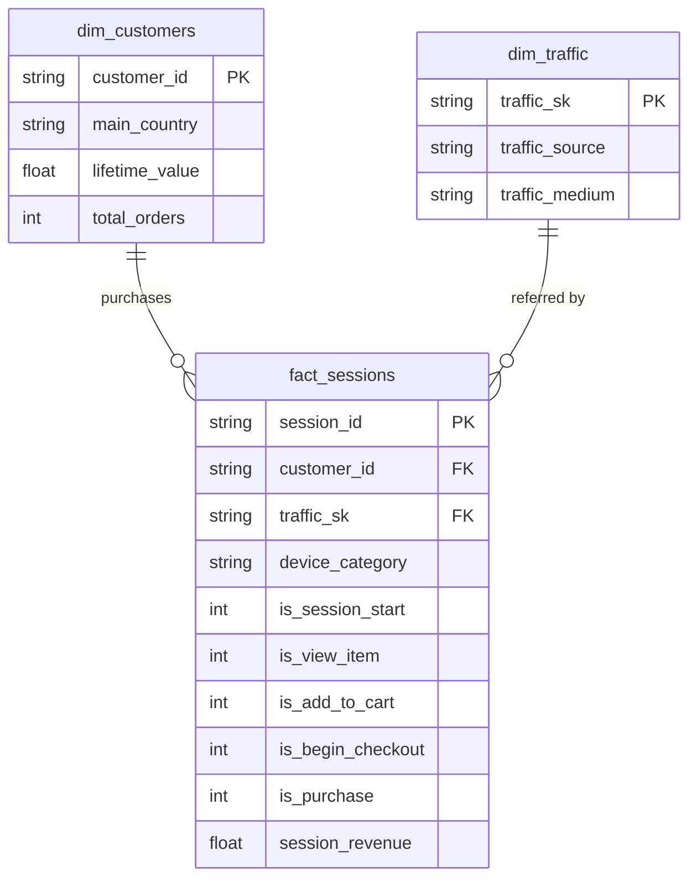

[](README.zh-TW.md)
&nbsp;&nbsp;
[](README.zh-CN.md)

# E-Commerce Customer Journey Analytics

**BigQuery · PostgreSQL · dbt · Power BI**

> End-to-end analytics pipeline: from raw GA4 event data to an interactive Power BI dashboard — covering data extraction, transformation, testing, and visualisation.

---

## Project Overview

This project performs a full customer journey analysis using the [GA4 Obfuscated Sample E-Commerce dataset](https://console.cloud.google.com/bigquery?p=bigquery-public-data&d=ga4_obfuscated_sample_ecommerce) — a real-world Google Analytics 4 dataset published by Google as a BigQuery public dataset.

The goal is to understand **how customers move through the purchase funnel**, identify high-value segments, and analyse conversion rates across traffic sources, devices, and geographies.

### What This Project Covers

- Extracting GA4 event data from **BigQuery** and loading into **PostgreSQL**
- Building a layered **dbt** transformation pipeline (staging → marts) with **26 data quality tests**
- Modelling a star schema: funnel fact table + customer and traffic dimensions
- Creating a **3-page Power BI dashboard** for funnel analysis, traffic performance, and customer segmentation
- Documenting data anomalies and design decisions in a problem-solving notebook


---

## Dataset

| Item | Detail |
|---|---|
| Source | [BigQuery Public Data — GA4 Obfuscated Sample E-Commerce](https://console.cloud.google.com/bigquery?p=bigquery-public-data&d=ga4_obfuscated_sample_ecommerce) |
| Time Range | November 2020 (30 days) |
| Scale | ~274,000 events · ~104,000 sessions · ~79,000 users · ~$144K revenue |
| Events Captured | `session_start`, `view_item`, `add_to_cart`, `begin_checkout`, `purchase` |
| Key Fields | event_date, event_time, event_name, user_pseudo_id, session_id, device_category, operating_system, country, city, traffic_source, traffic_medium, purchase_revenue, total_item_quantity |

---

## Tools & Technologies

| Tool | Purpose |
|---|---|
| BigQuery | Source data extraction (GA4 public dataset) |
| PostgreSQL | Data warehouse — stores raw and transformed tables |
| dbt | Data transformation pipeline (staging + marts layers) with schema tests |
| Power BI | 3-page interactive dashboard (funnel, traffic, customer segments) |
| GitHub | Version control and documentation |

---

## Architecture

```
BigQuery (GA4 Public Data)
        |
        v  SQL export --> CSV
PostgreSQL: raw.ga4_events
        |
        v  dbt staging layer
stg_ga4_events              <-- Cleaned & normalised (incremental)
        |                       . (not set)      --> NULL
        |                       . (data deleted)  --> Unknown
        |                       . <Other>         --> Unknown
        |                       . (direct)        --> Direct
        |                       . NULL revenue    --> 0
        |
        v  dbt marts layer (star schema)
+-------------------+    +-------------------+    +-------------------+
|  fact_sessions    |    |  dim_customers    |    |  dim_traffic      |
|  (incremental)    |<-->|  (table)          |    |  (table)          |
|  Session funnel   |    |  LTV + orders     |    |  Source / medium  |
|  flags + revenue  |    |  per customer     |    |  surrogate key    |
+-------------------+    +-------------------+    +-------------------+
        |
        v  26 schema tests (unique, not_null, accepted_values, relationships)
        |
        v
   Power BI Dashboard (3 pages)
```
### dbt Model Lineage



---

## 1. Data Extraction (BigQuery → PostgreSQL)

### BigQuery SQL — Funnel Event Extraction

```sql
SELECT
  event_date,
  TIMESTAMP_MICROS(event_timestamp)       AS event_time,
  event_name,
  user_pseudo_id,
  (SELECT value.int_value
   FROM UNNEST(event_params)
   WHERE key = 'ga_session_id')           AS session_id,
  device.category                         AS device_category,
  device.operating_system,
  geo.country,
  geo.city,
  traffic_source.source                   AS traffic_source,
  traffic_source.medium                   AS traffic_medium,
  ecommerce.purchase_revenue,
  ecommerce.total_item_quantity
FROM `bigquery-public-data.ga4_obfuscated_sample_ecommerce.events_*`
WHERE _TABLE_SUFFIX BETWEEN '20201101' AND '20201130'
  AND event_name IN (
    'session_start','view_item','add_to_cart','begin_checkout','purchase'
  )
```

The extracted CSV is loaded into `raw.ga4_events` in PostgreSQL using the scripts in `scripts/`.

---

## 2. dbt Transformation Pipeline

### Staging Layer — `stg_ga4_events`

**Materialisation**: Incremental (unique key: `session_id`)

| Transformation | Logic |
|---|---|
| Clean device & geo fields | `NULLIF(device_category, '(not set)')` — removes placeholder values |
| Normalise traffic source | `(data deleted)` / `<Other>` → `Unknown`; `(direct)` → `Direct` |
| Normalise traffic medium | `(data deleted)` / `(none)` / `<Other>` → `Unknown` |
| Fill missing revenue | `COALESCE(purchase_revenue, 0)` |
| Incremental filter | Only processes records newer than `max(event_time)` |

### Marts Layer (Star Schema)

#### Schema Overview
| Table | Type | Grain | Description |
|---|---|---|---|
| `fact_sessions` | Incremental | One row per session | Funnel flags + revenue |
| `dim_customers` | Table | One row per user | LTV + total orders |
| `dim_traffic` | Table | One row per source/medium combo | Traffic source dimension |


#### `fact_sessions` — Purchase Funnel Fact Table

**Materialisation**: Incremental (unique key: `session_id`)

Each row = one user session, with binary flags for each funnel stage:

| Column | Description |
|---|---|
| `session_id` | Unique session identifier (grain) |
| `customer_id` | User pseudo ID → joins to `dim_customers` |
| `traffic_sk` | Surrogate key → joins to `dim_traffic` |
| `device_category` | Device type for this session |
| `is_session_start` | 1 if session started |
| `is_view_item` | 1 if product was viewed |
| `is_add_to_cart` | 1 if item added to cart |
| `is_begin_checkout` | 1 if checkout initiated |
| `is_purchase` | 1 if purchase completed |
| `session_revenue` | Total purchase revenue in this session |

#### `dim_customers` — Customer Lifetime Value

| Column | Description |
|---|---|
| `customer_id` | User pseudo ID (primary key) |
| `main_country` | Most frequent country |
| `lifetime_value` | Total purchase revenue across all sessions |
| `total_orders` | Total number of purchase events |

#### `dim_traffic` — Traffic Source Dimension

Surrogate key generated via `dbt_utils.generate_surrogate_key(['traffic_source', 'traffic_medium'])`, enabling clean joins from `fact_sessions`.

### Data Quality Tests — 26 Tests

All models are covered by `schema.yml` tests across both staging and marts layers:

| Test Type | Count | Examples |
|---|---|---|
| `unique` | 3 | `session_id`, `customer_id`, `traffic_sk` |
| `not_null` | 12 | All primary keys, foreign keys, and required fields |
| `accepted_values` | 8 | device_category ∈ {mobile, desktop, tablet}, funnel flags ∈ {0, 1} |
| `relationships` | 3 | `fact_sessions.customer_id` → `dim_customers`, `traffic_sk` → `dim_traffic` |

```
$ dbt test
Completed successfully. PASS=26 WARN=0 ERROR=0 SKIP=0
```

---

## 3. Key Findings

### Purchase Funnel

```
session_start  →  view_item  →  add_to_cart  →  begin_checkout  →  purchase
   104,202         19,774          2,178            4,575            1,311
                   (19.0%)         (2.1%)           (4.4%)          (1.3%)
```

> **Note**: `begin_checkout` count (4,575) exceeds `add_to_cart` (2,178). This is a known GA4 data characteristic — 3,532 sessions triggered `begin_checkout` without a prior `add_to_cart` event, likely due to "Buy Now" flows or saved cart items where the `add_to_cart` event was not fired. See `problem_solve.ipynb` for the validation query.

### Sample Analytical Queries

**Funnel Conversion Rate**
```sql
SELECT
    COUNT(DISTINCT CASE WHEN is_session_start = 1 THEN session_id END) AS sessions,
    COUNT(DISTINCT CASE WHEN is_view_item     = 1 THEN session_id END) AS viewed_item,
    COUNT(DISTINCT CASE WHEN is_add_to_cart   = 1 THEN session_id END) AS added_to_cart,
    COUNT(DISTINCT CASE WHEN is_begin_checkout= 1 THEN session_id END) AS began_checkout,
    COUNT(DISTINCT CASE WHEN is_purchase      = 1 THEN session_id END) AS purchased
FROM marts.fact_sessions;
```

**Conversion Rate by Traffic Source**
```sql
SELECT
    t.traffic_source,
    COUNT(DISTINCT f.session_id)                                         AS total_sessions,
    SUM(f.is_purchase)                                                   AS purchases,
    ROUND(SUM(f.is_purchase)::NUMERIC / COUNT(DISTINCT f.session_id), 4) AS cvr
FROM marts.fact_sessions f
JOIN marts.dim_traffic t ON f.traffic_sk = t.traffic_sk
GROUP BY 1
ORDER BY cvr DESC;
```

**High-Value Customer Segment**
```sql
SELECT customer_id, main_country, lifetime_value, total_orders
FROM marts.dim_customers
WHERE total_orders >= 2
ORDER BY lifetime_value DESC
LIMIT 20;
```
---

## Dashboard Preview

### Page 1 — Executive Overview
- KPI cards, purchase funnel chart, device breakdown, and revenue by country 


### Page 2 — Conversion & Traffic
- Conversion rate by traffic medium/source, device-level metrics, and traffic × device matrix 


### Page 3 — Customer Segments
- Customer lifetime value distribution, LTV vs orders scatter plot, and top customers table


---

## Project Structure

```
02_Ecommerce_Customer_Journey/
│
├── data/
│   └── raw_ga4_events.csv                  # Extracted GA4 events (Nov 2020)
│
├── scripts/
│   ├── create_table.sql                    # PostgreSQL raw schema creation
│   └── copy_raw.sql                        # Load CSV into raw.ga4_events
│
├── ga4_dbt/                                # dbt project root
│   ├── dbt_project.yml                     # Project config (marts = table)
│   ├── packages.yml                        # dbt_utils dependency
│   ├── models/
│   │   ├── staging/
│   │   │   ├── _sources.yml                # Source definition (raw.ga4_events)
│   │   │   ├── schema.yml                  # Staging column tests (5 tests)
│   │   │   └── stg_ga4_events.sql          # Incremental staging model
│   │   └── marts/
│   │       ├── schema.yml                  # Marts column tests (21 tests)
│   │       ├── fact_sessions.sql           # Funnel fact table (incremental)
│   │       ├── dim_customers.sql           # Customer LTV dimension (table)
│   │       └── dim_traffic.sql             # Traffic source dimension (table)
│   ├── tests/                              # Custom data tests
│   ├── macros/                             # dbt macros
│   └── analyses/                           # Ad-hoc analytical SQL
│
├── dashboard/
│   ├── Journey.pbix                        # Power BI dashboard file
│   └── Journey.pdf                         # Dashboard export (for preview)
│
├── screenshot/
│   ├── bi01.png                            # Page 1 — Executive Overview
│   ├── bi02.png                            # Page 2 — Conversion & Traffic
│   ├── bi03.png                            # Page 3 — Customer Segments
│   └── schema.png                          # dbt model lineage diagram
│
├── problem_solve.ipynb                     # Data anomaly investigation & notes
├── LICENSE                                 # MIT License
├── README.md                               # English documentation
├── README.zh-TW.md                         # 繁體中文文件
└── README.zh-CN.md                         # 简体中文文档
```

---

## How to Reproduce

**Prerequisites**: Google Cloud account (BigQuery access), PostgreSQL 14+, Python 3.9+, dbt-postgres, Power BI Desktop

### Step 1 — Extract from BigQuery

Run the extraction SQL above in BigQuery Console and export the result as CSV.

### Step 2 — Load into PostgreSQL

```bash
psql -U postgres -f scripts/create_table.sql
# Edit scripts/copy_raw.sql to set your local CSV path, then:
psql -U postgres -f scripts/copy_raw.sql
```

### Step 3 — Run dbt

```bash
cd ga4_dbt
pip install dbt-postgres     # If not already installed
dbt deps                     # Install dbt_utils
dbt run                      # Build all models
dbt test                     # Run 26 data quality tests
```

### Step 4 — Open Power BI

1. Open `dashboard/Journey.pbix` in Power BI Desktop
2. Update the PostgreSQL connection to your local server
3. Refresh data — the dashboard will populate from the `marts` schema

---

## Known Issues & Design Decisions

| Item | Detail |
|---|---|
| `begin_checkout` > `add_to_cart` | 3,532 sessions skipped `add_to_cart` — a GA4 data characteristic, not a bug. See `problem_solve.ipynb`. |
| `stg_ga4_events` uses incremental | Chosen over `view` for performance with large GA4 event logs. Trade-off: requires `--full-refresh` when changing transformation logic. |
| `dbt_project.yml` English-only comments | Windows Traditional Chinese systems (cp950 encoding) fail to parse UTF-8 Chinese in this file. |
| Traffic source `(direct)` mapped to `Direct` | Preserved as a separate category — direct traffic (typed URL / bookmarks) is analytically meaningful, unlike `(data deleted)`. |

---

## Author

Ross Tang | [GitHub](https://github.com/ross-bi)

## License

This project is licensed under the [MIT License](./LICENSE).
