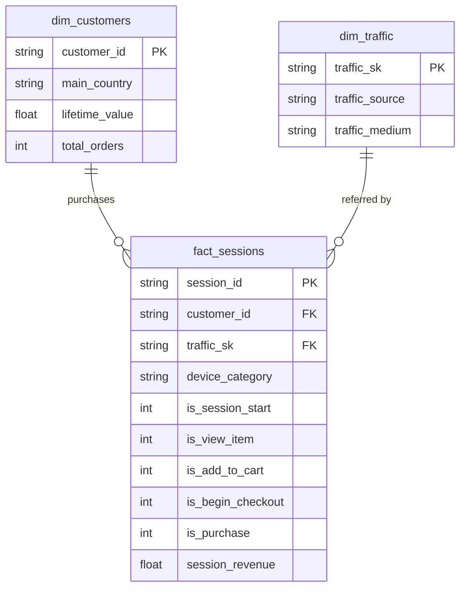
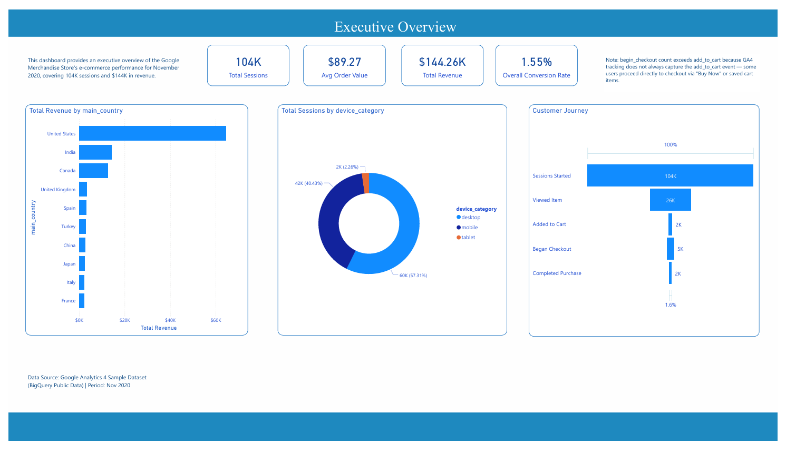
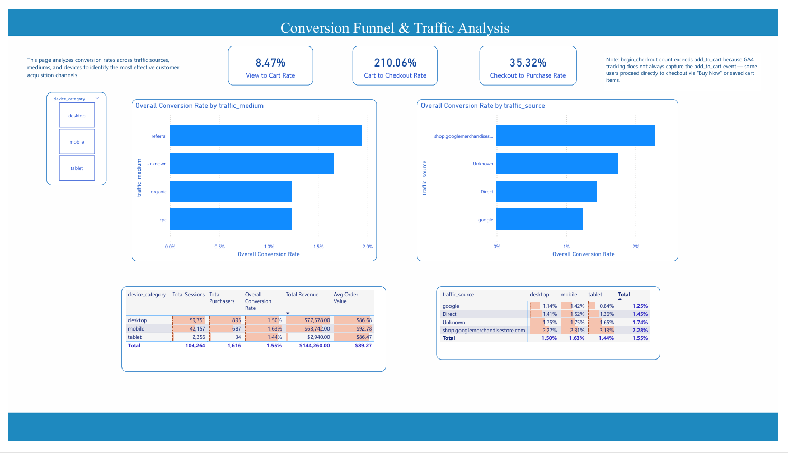
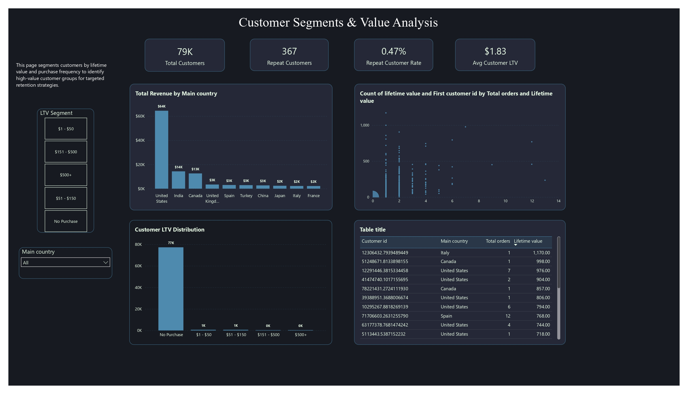

[](README.md)
&nbsp;&nbsp;
[](README.zh-TW.md)

# 电商客户旅程分析

**BigQuery · PostgreSQL · dbt · Power BI**

> 端到端分析管道：从原始 GA4 事件数据到交互式 Power BI 仪表板——涵盖数据提取、转换、测试与可视化。

---

## 专案概述

本项目使用 [GA4 混淆版电商范例数据集](https://console.cloud.google.com/bigquery?p=bigquery-public-data&d=ga4_obfuscated_sample_ecommerce)（Google 发布于 BigQuery 公开数据集的真实 Google Analytics 4 数据）进行完整的客户旅程分析。

目标在于了解**客户如何在购买漏斗中移动**、识别高价值客群，并分析不同流量来源、装置与地理区域的转换率。

### 涵盖内容

- 从 **BigQuery** 提取 GA4 事件资料，并加载 **PostgreSQL**
- 建立分层 **dbt** 转换管道（staging → marts），包含 **26 项数据质量测试**
- 建模星型结构：漏斗事实表 + 客户维度表与流量维度表
- 建立 **3 页 Power BI 仪表板**，涵盖漏斗分析、流量效益与客户分群
- 在问题解决笔记本中记录数据异常与设计决策

---

## 数据集

| 项目 | 详情 |
|---|---|
| 来源 | [BigQuery 公开资料 — GA4 混淆版电商范例](https://console.cloud.google.com/bigquery?p=bigquery-public-data&d=ga4_obfuscated_sample_ecommerce) |
| 时间范围 | 2020 年 11 月（30 天） |
| 规模 | 约 274,000 笔事件 · 约 104,000 个会话 · 约 79,000 位用户 · 约 $144K 收入 |
| 撷取事件 | `session_start`、`view_item`、`add_to_cart`、`begin_checkout`、`purchase` |
| 关键字段 | event_date, event_time, event_name, user_pseudo_id, session_id, device_category, operating_system, country, city, traffic_source, traffic_medium, purchase_revenue, total_item_quantity |

---

## 工具与技术

| 工具 | 用途 |
|---|---|
| BigQuery | 原始资料提取（GA4 公开数据集） |
| PostgreSQL | 数据仓储——储存原始及转换后的数据表 |
| dbt | 数据转换管道（staging + marts 层），含结构测试 |
| Power BI | 3 页交互式仪表板（漏斗、流量、客户分群） |
| Python | 数据质量验证脚本（`scripts/data_quality_check.py`） |
| GitHub | 版本控制与文件 |

---

## 架构
```
BigQuery (GA4 Public Data)
        |
        v  SQL export --> CSV
PostgreSQL: raw.ga4_events
        |
        v  dbt staging layer
stg_ga4_events              <-- Cleaned & normalised (incremental)
        |                       . (not set)      --> NULL
        |                       . (data deleted)  --> Unknown
        |                       . <Other>         --> Unknown
        |                       . (direct)        --> Direct
        |                       . NULL revenue    --> 0
        |
        v  dbt marts layer (star schema)
+-------------------+    +-------------------+    +-------------------+
|  fact_sessions    |    |  dim_customers    |    |  dim_traffic      |
|  (incremental)    |<-->|  (table)          |    |  (table)          |
|  Session funnel   |    |  LTV + orders     |    |  Source / medium  |
|  flags + revenue  |    |  per customer     |    |  surrogate key    |
+-------------------+    +-------------------+    +-------------------+
        |
        v  26 schema tests (unique, not_null, accepted_values, relationships)
        |
        v
   Power BI Dashboard (3 pages)
```

### dbt 模型血缘图



---

## 1. 资料提取（BigQuery → PostgreSQL）

### BigQuery SQL — 漏斗事件提取

```sql
SELECT
  event_date,
  TIMESTAMP_MICROS(event_timestamp)       AS event_time,
  event_name,
  user_pseudo_id,
  (SELECT value.int_value
   FROM UNNEST(event_params)
   WHERE key = 'ga_session_id')           AS session_id,
  device.category                         AS device_category,
  device.operating_system,
  geo.country,
  geo.city,
  traffic_source.source                   AS traffic_source,
  traffic_source.medium                   AS traffic_medium,
  ecommerce.purchase_revenue,
  ecommerce.total_item_quantity
FROM `bigquery-public-data.ga4_obfuscated_sample_ecommerce.events_*`
WHERE _TABLE_SUFFIX BETWEEN '20201101' AND '20201130'
  AND event_name IN (
    'session_start','view_item','add_to_cart','begin_checkout','purchase'
  )
```

提取的 CSV 档案透过 `scripts/` 目录中的脚本加载至 PostgreSQL 的 `raw.ga4_events`。

---

## 2. dbt 转换管道

### Staging 层 — `stg_ga4_events`

**物化方式**：Incremental（唯一键：`session_id`）

| 转换项目 | 逻辑 |
|---|---|
| 清洗装置与地理字段 | `NULLIF(device_category, '(not set)')` — 移除占位值 |
| 标准化流量来源 | `(data deleted)` / `<Other>` → `Unknown`；`(direct)` → `Direct` |
| 标准化流量媒介 | `(data deleted)` / `(none)` / `<Other>` → `Unknown` |
| 填补缺失收入 | `COALESCE(purchase_revenue, 0)` |
| Incremental 筛选 | 仅处理 `max(event_time)` 之后的新纪录 |

### Marts 层（星型结构）

#### 结构概览

| 数据表 | 类型 | 粒度 | 描述 |
|---|---|---|---|
| `fact_sessions` | Incremental | 每个会话一列 | 漏斗标记 + 收入 |
| `dim_customers` | Table | 每位用户一列 | LTV + 总订单数 |
| `dim_traffic` | Table | 每个来源/媒介组合一列 | 流量来源维度 |

#### `fact_sessions` — 购买漏斗事实表

**物化方式**：Incremental（唯一键：`session_id`）

每列代表一个用户会话，并以二元标记表示各漏斗阶段：

| 字段 | 描述 |
|---|---|
| `session_id` | 唯一会话标识符（粒度） |
| `customer_id` | 用户伪 ID → 关联至 `dim_customers` |
| `traffic_sk` | 代理键 → 关联至 `dim_traffic` |
| `device_category` | 本次会话的装置类型 |
| `is_session_start` | 1 表示会话已开始 |
| `is_view_item` | 1 表示已浏览商品 |
| `is_add_to_cart` | 1 表示已加入购物车 |
| `is_begin_checkout` | 1 表示已开始结账 |
| `is_purchase` | 1 表示已完成购买 |
| `session_revenue` | 本次会话的总购买收入 |

#### `dim_customers` — 客户终身价值

| 字段 | 描述 |
|---|---|
| `customer_id` | 用户伪 ID（主键） |
| `main_country` | 最常出现的国家 |
| `lifetime_value` | 所有会话的累计购买收入 |
| `total_orders` | 购买事件总次数 |

#### `dim_traffic` — 流量来源维度

代理键透过 `dbt_utils.generate_surrogate_key(['traffic_source', 'traffic_medium'])` 产生，让 `fact_sessions` 可进行干净的关联查询。

### 数据质量测试 — 26 项

所有模型均由 `schema.yml` 覆盖，涵盖 staging 与 marts 层的测试：

| 测试类型 | 数量 | 范例 |
|---|---|---|
| `unique` | 3 | `session_id`、`customer_id`、`traffic_sk` |
| `not_null` | 12 | 所有主键、外键及必要字段 |
| `accepted_values` | 8 | device_category ∈ {mobile, desktop, tablet}，漏斗标记 ∈ {0, 1} |
| `relationships` | 3 | `fact_sessions.customer_id` → `dim_customers`，`traffic_sk` → `dim_traffic` |
```
$ dbt test
Completed successfully. PASS=26 WARN=0 ERROR=0 SKIP=0
```

---

## 3. 主要发现

### 购买漏斗
```
session_start → view_item → add_to_cart → begin_checkout → purchase
104,202 19,774 2,178 4,575 1,311
(19.0%) (2.1%) (4.4%) (1.3%)
```

> **备注**：`begin_checkout` 数量（4,575）超过 `add_to_cart`（2,178）。这是 GA4 的已知数据特性——有 3,532 个会话在没有先触发 `add_to_cart` 事件的情况下就触发了 `begin_checkout`，可能是因为「立即购买」流程或已储存的购物车导致 `add_to_cart` 事件未被触发。详见 `problem_solve.ipynb` 的验证查询。

### 范例分析查询

**漏斗转换率**
```sql
SELECT
    COUNT(DISTINCT CASE WHEN is_session_start = 1 THEN session_id END) AS sessions,
    COUNT(DISTINCT CASE WHEN is_view_item     = 1 THEN session_id END) AS viewed_item,
    COUNT(DISTINCT CASE WHEN is_add_to_cart   = 1 THEN session_id END) AS added_to_cart,
    COUNT(DISTINCT CASE WHEN is_begin_checkout= 1 THEN session_id END) AS began_checkout,
    COUNT(DISTINCT CASE WHEN is_purchase      = 1 THEN session_id END) AS purchased
FROM marts.fact_sessions;
```

**依流量来源的转换率**
```sql
SELECT
    t.traffic_source,
    COUNT(DISTINCT f.session_id)                                         AS total_sessions,
    SUM(f.is_purchase)                                                   AS purchases,
    ROUND(SUM(f.is_purchase)::NUMERIC / COUNT(DISTINCT f.session_id), 4) AS cvr
FROM marts.fact_sessions f
JOIN marts.dim_traffic t ON f.traffic_sk = t.traffic_sk
GROUP BY 1
ORDER BY cvr DESC;
```

**高价值客户分群**
```sql
SELECT customer_id, main_country, lifetime_value, total_orders
FROM marts.dim_customers
WHERE total_orders >= 2
ORDER BY lifetime_value DESC
LIMIT 20;
```

---

## 仪表板预览

### 第 1 页 — 执行摘要


- **KPI 卡片**：总收入（约 $144K）、总会话数（104K）、整体转换率（1.3%）、平均订单金额（约 $89）
- **购买漏斗**：从会话开始 → 浏览 → 加入购物车 → 结账 → 购买的可视化流失；显示仅 19% 的会话到达商品页
- **装置分析**：桌机 / 手机 / 平板的转换占比，桌机通常在收入贡献上领先
- **各国收入**：美国以约 $64K 居冠；加拿大、印度及英国为核心市场

### 第 2 页 — 转换与流量


- **各流量来源与媒介的转换率**：推荐流量（shop.googlemerchandisestore.com）以 2.2–2.3% 的转换率居冠，优于自然搜寻（约 1.1–1.5%）及付费搜寻（约 1.2%）
- **流量 × 装置矩阵**：来源/媒介与装置的交叉分析，找出同时带动流量与效益的组合
- **装置层级指针**：手机版 Google 自然搜寻表现突出——在大流量下仍维持具竞争力的转换率

### 第 3 页 — 客户分群


- **LTV 分布**：客户依 VIP / 高 / 中 / 低分层；大部分收入集中在顶层少数客户
- **LTV 与总订单数散布图**：揭示高终身价值的回购客户——主要透过自然搜寻及推荐管道获取
- **顶级客户排行榜**：依终身收入与订单数排名，支持精准留存策略

## 主要发现

### 漏斗效益

| 阶段 | 会话数 | 比率 |
|---|---|---|
| 会话开始 | 104,202 | — |
| 浏览商品 | 19,774 | 19.0% |
| 加入购物车 | 2,178 | 2.1% |
| 开始结账 | 4,575 | 4.4% |
| 完成购买 | 1,311 | 1.3% |

每 5 个会话中仅 1 个到达商品页，不足 1.6% 完成购买——显示在发现与结账阶段均有显著流失。`begin_checkout` 超过 `add_to_cart` 是 GA4 的已知实作特性（详见 `problem_solve.ipynb`）。

### 流量与转换

| 流量来源 | 装置 | 会话数 | 转换率 | 收入 |
|---|---|---|---|---|
| google / organic | 桌机 | 18,182 | 1.12% | $16,431 |
| Direct | 桌机 | 13,921 | 1.41% | $17,597 |
| google / organic | 手机 | 12,804 | 1.45% | $19,649 |
| 推荐（merch store） | 桌机 | 5,130 | **2.22%** | $10,599 |
| 推荐（merch store） | 手机 | 3,684 | **2.31%** | $6,986 |
| google / cpc | 多种 | — | 约 1.2–1.3% | 偏低 |

来自 `shop.googlemerchandisestore.com` 的推荐流量在各装置上均稳定维持最高转换率，而付费搜寻（CPC）在转换率与收入上均不及自然搜寻与推荐流量。

### 地理洞察

| 市场 | 会话数 | 收入 | 平均 LTV | 备注 |
|---|---|---|---|---|
| 美国 | 45,784 | $64,443 | $4.20 | 核心市场，流量最高 |
| 印度 | 约 9,862 | $14,304 | $4.1+ | 转换率约 1.76%，表现强劲 |
| 加拿大 | 约 7,691 | $12,591 | $4.1+ | 高效率中型市场 |
| 芬兰 | 165 | $561 | **$22.70** | LTV 极高，利基精品市场 |
| 巴林 | 少量 | 约 $206 | **$25.75** | 平均 LTV 最高 |
| 挪威 | 173 | $0 | — | 有会话但零购买 |

收入集中在少数大型市场，但芬兰、巴林、希腊等小型市场呈现极高的平均 LTV 与订单金额——显示有精准扩张的潜力。

### 客户价值

高 LTV 客户（多次订购、较高终身消费）的获取管道不成比例地集中在自然搜寻与推荐流量。`dim_customers` mart 支持将客户分为 LTV 层级（VIP / 高 / 中 / 低），并可交叉筛选流量来源、装置与地理位置，以支持留存策略规划。

---

## 商业建议

1. **改善商品发现与结账的使用者体验** — 仅 19% 的会话浏览到商品，且整体转换率仅 1.3%，改善站内搜寻、商品列表相关性及结账流程简化，可对收入产生显著影响。

2. **将预算转移至自然搜寻与推荐管道** — 推荐流量（转换率 2.2–2.3%）与 Google 自然搜寻持续优于付费搜寻，应投资于 SEO、内容营销及高意图推荐合作，同时严格审视付费搜寻的投资报酬率。

3. **针对高 LTV 市场进行在地化营销** — 芬兰、巴林、希腊等市场虽流量有限，却有极高的平均订单金额，针对性的营销活动、本地货币及客制化运送选项有望带来不成比例的回报。

4. **调查零转换市场** — 挪威等市场有一定的会话量但无购买记录，应在投入流量成长前，审查是否存在付款方式缺口、运送限制或在地化障碍。

5. **建立基于 LTV 的分群机制与同期群追踪** — 利用现有的 `dim_customers` mart 与 Power BI LTV 分群，监控不同获取管道对长期客户价值的贡献，并指导留存计划的投资方向。

---

## 项目结构
```
02_Ecommerce_Customer_Journey/
│
├── data/
│ └── raw_ga4_events.csv # 提取的 GA4 事件（2020 年 11 月）
│
├── scripts/
│ ├── create_table.sql # PostgreSQL 原始结构建立
│ ├── copy_raw.sql # 将 CSV 载入 raw.ga4_events
│ └── data_quality_check.py # Python 数据质量验证（7 项检查）
│
├── ga4_dbt/ # dbt 项目根目录
│ ├── dbt_project.yml # 项目设定（marts = table）
│ ├── packages.yml # dbt_utils 相依套件
│ ├── models/
│ │ ├── staging/
│ │ │ ├── _sources.yml # 来源定义（raw.ga4_events）
│ │ │ ├── schema.yml # Staging 字段测试（5 项）
│ │ │ └── stg_ga4_events.sql # Incremental staging 模型
│ │ └── marts/
│ │ ├── schema.yml # Marts 字段测试（21 项）
│ │ ├── fact_sessions.sql # 漏斗事实表（incremental）
│ │ ├── dim_customers.sql # 客户 LTV 维度（table）
│ │ └── dim_traffic.sql # 流量来源维度（table）
│ ├── tests/ # 自定义资料测试
│ ├── macros/ # dbt macros
│ └── analyses/ # 临时分析 SQL
│
├── dashboard/
│ ├── Journey.pbix # Power BI 仪表板档案
│ └── Journey.pdf # 仪表板汇出（预览用）
│
├── screenshot/
│ ├── bi01.png # 第 1 页 — 执行摘要
│ ├── bi02.png # 第 2 页 — 转换与流量
│ ├── bi03.png # 第 3 页 — 客户分群
│ └── schema.png # dbt 模型血缘图
│
├── problem_solve.ipynb # 数据异常调查与笔记
├── LICENSE # MIT 授权条款
├── README.md # 英文文件
├── README.zh-TW.md # 繁体中文文件
└── README.zh-CN.md # 简体中文文档
```

---

## 重现步骤

**前置条件**：Google Cloud 账号（BigQuery 存取权）、PostgreSQL 14+、Python 3.9+、dbt-postgres、Power BI Desktop

### 步骤一 — 从 BigQuery 提取数据

在 BigQuery 控制台执行上述提取 SQL，并将结果汇出为 CSV。

### 步骤二 — 载入至 PostgreSQL

```bash
psql -U postgres -f scripts/create_table.sql
# 编辑 scripts/copy_raw.sql 设定本地 CSV 路径，然后：
psql -U postgres -f scripts/copy_raw.sql
```
### 步骤 2.5 — 执行数据质量验证（可选）

```bash
pip install pandas               # 若尚未安装
export DB_HOST=localhost
export DB_NAME=ecommerce
export DB_USER=postgres
export DB_PASSWORD=your_password

python scripts/data_quality_check.py
```

对所有 mart 数据表执行 7 项验证（行数、NULL 比例、主键唯一性、参照完整性、漏斗逻辑、收入合理性、事件覆盖率），并输出 `data_quality_report.csv`。

### 步骤三 — 执行 dbt

```bash
cd ga4_dbt
pip install dbt-postgres     # 若尚未安装
dbt deps                     # 安装 dbt_utils
dbt run                      # 建立所有模型
dbt test                     # 执行 26 项数据质量测试
```

### 步骤四 — 开启 Power BI

1. 在 Power BI Desktop 中开启 `dashboard/Journey.pbix`
2. 将 PostgreSQL 联机更新为你的本地服务器
3. 重新整理数据——仪表板将从 `marts` 结构填入数据

---

## 已知问题与设计决策

| 项目 | 详情 |
|---|---|
| `begin_checkout` > `add_to_cart` | 3,532 个会话跳过了 `add_to_cart`——这是 GA4 的数据特性，非错误。详见 `problem_solve.ipynb`。 |
| `stg_ga4_events` 使用 incremental | 考虑大型 GA4 事件日志的效能，选用 incremental 而非 `view`。代价是：更改转换逻辑时需执行 `--full-refresh`。 |
| `dbt_project.yml` 仅用英文批注 | Windows 繁体中文系统（cp950 编码）无法解析此档案中的 UTF-8 汉字字符。 |
| 流量来源 `(direct)` 对应至 `Direct` | 保留为独立类别——直接流量（输入网址 / 书签）在分析上具有意义，不同于 `(data deleted)`。 |

---

## 作者

Ross Tang | [GitHub](https://github.com/ross-bi)

## 授权条款

本项目采用 [MIT 授权条款](./LICENSE)。

