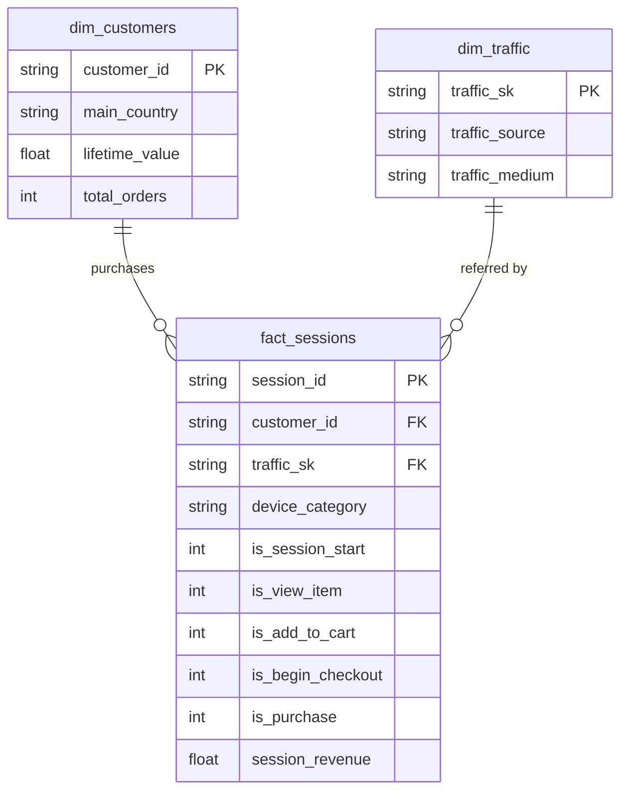

[](README.md)
&nbsp;&nbsp;
[](README.zh-TW.md)

# 电商顾客旅程分析

**BigQuery · PostgreSQL · dbt · Power BI**

> 端到端分析流程：从 GA4 原始事件数据到交互式 Power BI 仪表板 — 涵盖数据提取、转换、测试与可视化。

---

## 项目概述

本项目使用 [GA4 Obfuscated Sample E-Commerce 数据集](https://console.cloud.google.com/bigquery?p=bigquery-public-data&d=ga4_obfuscated_sample_ecommerce)（Google 发布的 BigQuery 公开数据集，真实电商数据经过混淆处理），进行完整的电商顾客旅程分析。

目标是了解**顾客如何在购物漏斗中移动**、识别高价值客群，以及分析各流量来源、设备与地区的转换率表现。

### 涵盖范畴

- 从 **BigQuery** 提取 GA4 事件数据并加载 **PostgreSQL**
- 建立分层 **dbt** 转换流程（staging → marts），包含 **26 项数据质量测试**
- 建模星型模式：漏斗事实表 + 顾客维度表 + 流量维度表
- 建立 **3 页 Power BI 交互式仪表板**：漏斗分析、流量表现、顾客分群
- 在问题解决笔记本中记录数据异常与设计决策

---

## 仪表板预览

| 第 1 页 — 总览 | 第 2 页 — 转换与流量 | 第 3 页 — 顾客分群 |
|:---:|:---:|:---:|
|  |  |  |

**第 1 页** — KPI 卡片、购物漏斗图、设备分布、各国收入  
**第 2 页** — 各流量媒介/来源的转换率、设备层级指标、流量 × 设备交叉分析  
**第 3 页** — 顾客终身价值分布、LTV vs 订单数散点图、高价值顾客排行

---

## 数据集

| 项目 | 说明 |
|---|---|
| 来源 | [BigQuery 公开数据 — GA4 Obfuscated Sample E-Commerce](https://console.cloud.google.com/bigquery?p=bigquery-public-data&d=ga4_obfuscated_sample_ecommerce) |
| 时间范围 | 2020 年 11 月（共 30 天）|
| 数据规模 | 约 274,000 条事件 · 约 104,000 个会话 · 约 79,000 位用户 · 约 $144K 营收 |
| 采集事件 | `session_start`、`view_item`、`add_to_cart`、`begin_checkout`、`purchase` |
| 主要字段 | event_date、event_time、event_name、user_pseudo_id、session_id、device_category、operating_system、country、city、traffic_source、traffic_medium、purchase_revenue、total_item_quantity |

---

## 工具与技术

| 工具 | 用途 |
|---|---|
| BigQuery | 源数据提取（GA4 公开数据集）|
| PostgreSQL | 数据仓库 — 存储原始及转换后的数据表 |
| dbt | 数据转换流程（staging + marts 分层）含 schema 测试 |
| Power BI | 3 页交互式仪表板（漏斗、流量、顾客分群）|
| GitHub | 版本控制与文档记录 |

---

## 架构

```
BigQuery (GA4 Public Data)
        |
        v  SQL export --> CSV
PostgreSQL: raw.ga4_events
        |
        v  dbt staging layer
stg_ga4_events              <-- Cleaned & normalised (incremental)
        |                       . (not set)      --> NULL
        |                       . (data deleted)  --> Unknown
        |                       . <Other>         --> Unknown
        |                       . (direct)        --> Direct
        |                       . NULL revenue    --> 0
        |
        v  dbt marts layer (star schema)
+-------------------+    +-------------------+    +-------------------+
|  fact_sessions    |    |  dim_customers    |    |  dim_traffic      |
|  (incremental)    |<-->|  (table)          |    |  (table)          |
|  Session funnel   |    |  LTV + orders     |    |  Source / medium  |
|  flags + revenue  |    |  per customer     |    |  surrogate key    |
+-------------------+    +-------------------+    +-------------------+
        |
        v  26 schema tests (unique, not_null, accepted_values, relationships)
        |
        v
   Power BI Dashboard (3 pages)
```
### dbt 模型谱系



---

## 一、数据提取（BigQuery → PostgreSQL）

### BigQuery SQL — 漏斗事件提取

```sql
SELECT
  event_date,
  TIMESTAMP_MICROS(event_timestamp)       AS event_time,
  event_name,
  user_pseudo_id,
  (SELECT value.int_value
   FROM UNNEST(event_params)
   WHERE key = 'ga_session_id')           AS session_id,
  device.category                         AS device_category,
  device.operating_system,
  geo.country,
  geo.city,
  traffic_source.source                   AS traffic_source,
  traffic_source.medium                   AS traffic_medium,
  ecommerce.purchase_revenue,
  ecommerce.total_item_quantity
FROM `bigquery-public-data.ga4_obfuscated_sample_ecommerce.events_*`
WHERE _TABLE_SUFFIX BETWEEN '20201101' AND '20201130'
  AND event_name IN (
    'session_start','view_item','add_to_cart','begin_checkout','purchase'
  )
```

提取的 CSV 通过 `scripts/` 内的脚本加载到 PostgreSQL 的 `raw.ga4_events`。

---

## 二、dbt 数据转换流程

### Staging 层 — `stg_ga4_events`

**物化方式**：增量模型（unique_key：`session_id`）

| 转换项目 | 逻辑 |
|---|---|
| 清理设备与地区字段 | `NULLIF(device_category, '(not set)')` — 移除占位值 |
| 标准化流量来源 | `(data deleted)` / `<Other>` → `Unknown`；`(direct)` → `Direct` |
| 标准化流量媒介 | `(data deleted)` / `(none)` / `<Other>` → `Unknown` |
| 填补缺失金额 | `COALESCE(purchase_revenue, 0)` |
| 增量筛选 | 仅处理比 `max(event_time)` 更新的记录 |

### Marts 层（星型模式）

#### 纲要总览
| 资料表 | 类型 | 粒度 | 说明 |
|---|---|---|---|
| `fact_sessions` | Incremental | 每个 Session 一笔记录 | 漏斗旗标 + 营收 |
| `dim_customers` | Table | 每位用户一笔记录 | 客户终身价值 + 订单数 |
| `dim_traffic` | Table | 每组来源／媒介一笔记录 | 流量来源维度 |

#### `fact_sessions` — 购物漏斗事实表

**物化方式**：增量模型（unique_key：`session_id`）

每一行代表一个用户会话，包含各漏斗阶段的二元标记：

| 字段 | 说明 |
|---|---|
| `session_id` | 唯一会话标识符（粒度键）|
| `customer_id` | 用户 pseudo ID → 关联 `dim_customers` |
| `traffic_sk` | 代理键 → 关联 `dim_traffic` |
| `device_category` | 此会话的设备类型 |
| `is_session_start` | 1 = 会话已开始 |
| `is_view_item` | 1 = 已浏览商品 |
| `is_add_to_cart` | 1 = 已加入购物车 |
| `is_begin_checkout` | 1 = 已开始结账 |
| `is_purchase` | 1 = 已完成购买 |
| `session_revenue` | 此会话的购买总金额 |

#### `dim_customers` — 顾客终身价值维度

| 字段 | 说明 |
|---|---|
| `customer_id` | 用户 pseudo ID（主键）|
| `main_country` | 最常出现的国家/地区 |
| `lifetime_value` | 所有会话的购买总金额 |
| `total_orders` | 购买事件总次数 |

#### `dim_traffic` — 流量来源维度

通过 `dbt_utils.generate_surrogate_key(['traffic_source', 'traffic_medium'])` 生成代理键，便于从 `fact_sessions` 进行干净的 JOIN 关联。

### 数据质量测试 — 26 项

所有模型均有 `schema.yml` 测试覆盖，横跨 staging 与 marts 两层：

| 测试类型 | 数量 | 示例 |
|---|---|---|
| `unique` | 3 | `session_id`、`customer_id`、`traffic_sk` |
| `not_null` | 12 | 所有主键、外键及必填字段 |
| `accepted_values` | 8 | device_category ∈ {mobile, desktop, tablet}、漏斗标记 ∈ {0, 1} |
| `relationships` | 3 | `fact_sessions.customer_id` → `dim_customers`、`traffic_sk` → `dim_traffic` |

```
$ dbt test
Completed successfully. PASS=26 WARN=0 ERROR=0 SKIP=0
```

---

## 三、主要发现

### 购物漏斗

```
session_start  →  view_item  →  add_to_cart  →  begin_checkout  →  purchase
   104,202         19,774          2,178            4,575            1,311
                   (19.0%)         (2.1%)           (4.4%)          (1.3%)
```

> **注意**：`begin_checkout` 数量（4,575）超过 `add_to_cart`（2,178）。这是 GA4 数据的已知特性 — 有 3,532 个会话触发了 `begin_checkout` 但没有 `add_to_cart` 事件，可能因为"直接购买"流程或已保存的购物车项目未触发 `add_to_cart` 事件。详见 `problem_solve.ipynb`。

### 常用分析查询

**漏斗转换率**
```sql
SELECT
    COUNT(DISTINCT CASE WHEN is_session_start = 1 THEN session_id END) AS sessions,
    COUNT(DISTINCT CASE WHEN is_view_item     = 1 THEN session_id END) AS viewed_item,
    COUNT(DISTINCT CASE WHEN is_add_to_cart   = 1 THEN session_id END) AS added_to_cart,
    COUNT(DISTINCT CASE WHEN is_begin_checkout= 1 THEN session_id END) AS began_checkout,
    COUNT(DISTINCT CASE WHEN is_purchase      = 1 THEN session_id END) AS purchased
FROM marts.fact_sessions;
```

**各流量来源转换率**
```sql
SELECT
    t.traffic_source,
    COUNT(DISTINCT f.session_id)                                         AS total_sessions,
    SUM(f.is_purchase)                                                   AS purchases,
    ROUND(SUM(f.is_purchase)::NUMERIC / COUNT(DISTINCT f.session_id), 4) AS cvr
FROM marts.fact_sessions f
JOIN marts.dim_traffic t ON f.traffic_sk = t.traffic_sk
GROUP BY 1
ORDER BY cvr DESC;
```

**高价值顾客分群**
```sql
SELECT customer_id, main_country, lifetime_value, total_orders
FROM marts.dim_customers
WHERE total_orders >= 2
ORDER BY lifetime_value DESC
LIMIT 20;
```

---

## 项目结构

```
02_Ecommerce_Customer_Journey/
│
├── data/
│   └── raw_ga4_events.csv                  # 提取的 GA4 事件（2020 年 11 月）
│
├── scripts/
│   ├── create_table.sql                    # PostgreSQL raw 模式创建
│   └── copy_raw.sql                        # 加载 CSV 至 raw.ga4_events
│
├── ga4_dbt/                                # dbt 项目根目录
│   ├── dbt_project.yml                     # 项目配置（marts = table）
│   ├── packages.yml                        # dbt_utils 包依赖
│   ├── models/
│   │   ├── staging/
│   │   │   ├── _sources.yml                # 来源定义（raw.ga4_events）
│   │   │   ├── schema.yml                  # Staging 字段测试（5 项）
│   │   │   └── stg_ga4_events.sql          # 增量 staging 模型
│   │   └── marts/
│   │       ├── schema.yml                  # Marts 字段测试（21 项）
│   │       ├── fact_sessions.sql           # 漏斗事实表（增量）
│   │       ├── dim_customers.sql           # 顾客 LTV 维度（table）
│   │       └── dim_traffic.sql             # 流量来源维度（table）
│   ├── tests/                              # 自定义数据测试
│   ├── macros/                             # dbt 宏
│   └── analyses/                           # 临时分析 SQL
│
├── dashboard/
│   ├── Journey.pbix                        # Power BI 仪表板文件
│   └── Journey.pdf                         # 仪表板导出（预览用）
│
├── screenshot/
│   ├── bi01.png                            # 第 1 页 — 总览
│   ├── bi02.png                            # 第 2 页 — 转换与流量
│   ├── bi03.png                            # 第 3 页 — 顾客分群
│   └── schema.png                          # dbt 模型血缘图
│
├── problem_solve.ipynb                     # 数据异常调查与笔记
├── LICENSE                                 # MIT 许可证
├── README.md                               # English 文档
├── README.zh-TW.md                         # 繁體中文文件
└── README.zh-CN.md                         # 简体中文文档
```

---

## 如何重现本项目

**前置需求**：Google Cloud 账户（BigQuery 访问）、PostgreSQL 14+、Python 3.9+、dbt-postgres、Power BI Desktop

### 步骤 1 — 从 BigQuery 提取

在 BigQuery Console 执行上述提取 SQL，并将结果导出为 CSV。

### 步骤 2 — 加载到 PostgreSQL

```bash
psql -U postgres -f scripts/create_table.sql
# 编辑 scripts/copy_raw.sql，设置你的本地 CSV 路径，然后：
psql -U postgres -f scripts/copy_raw.sql
```

### 步骤 3 — 执行 dbt

```bash
cd ga4_dbt
pip install dbt-postgres     # 若尚未安装
dbt deps                     # 安装 dbt_utils
dbt run                      # 构建所有模型
dbt test                     # 执行 26 项数据质量测试
```

### 步骤 4 — 打开 Power BI

1. 在 Power BI Desktop 打开 `dashboard/Journey.pbix`
2. 更新 PostgreSQL 连接至你的本地服务器
3. 刷新数据 — 仪表板会从 `marts` 模式读取数据

---

## 已知问题与设计决策

| 项目 | 说明 |
|---|---|
| `begin_checkout` > `add_to_cart` | 3,532 个会话跳过了 `add_to_cart` — 这是 GA4 数据特性，非 Bug。详见 `problem_solve.ipynb`。|
| `stg_ga4_events` 使用增量模型 | 为大量 GA4 事件日志选择性能优先方案。代价：修改转换逻辑时需执行 `--full-refresh`。|
| `dbt_project.yml` 仅使用英文注释 | Windows 繁体中文系统（cp950 编码）无法解析此文件中的 UTF-8 中文字符。|
| 流量来源 `(direct)` 映射为 `Direct` | 保留为独立类别 — 直接流量（输入网址/书签）具有分析意义，与 `(data deleted)` 不同。|

---

## 作者

Ross Tang | [GitHub](https://github.com/ross-bi)

## 许可证

本项目采用 [MIT License](./LICENSE) 授权。
