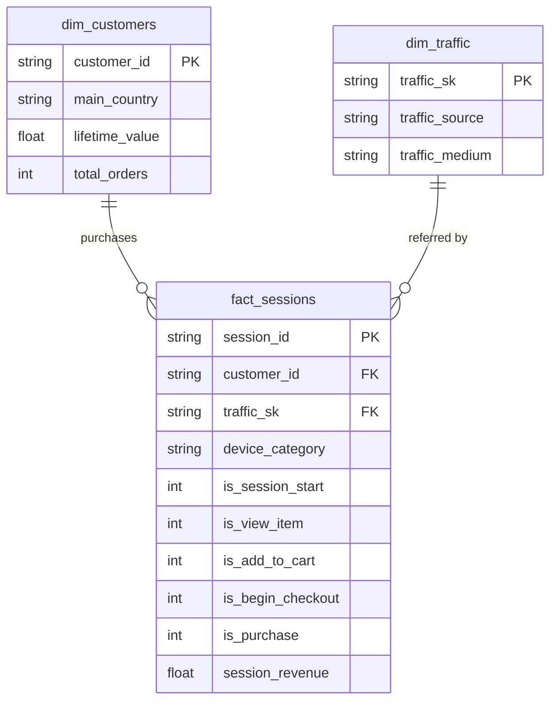

[](README.md)
&nbsp;&nbsp;
[](README.zh-CN.md)

# 電商客戶旅程分析

**BigQuery · PostgreSQL · dbt · Power BI**

> 端到端分析管道：從原始 GA4 事件資料到互動式 Power BI 儀表板——涵蓋資料提取、轉換、測試與視覺化。

---

## 專案概述

本專案使用 [GA4 混淆版電商範例資料集](https://console.cloud.google.com/bigquery?p=bigquery-public-data&d=ga4_obfuscated_sample_ecommerce)（Google 發布於 BigQuery 公開資料集的真實 Google Analytics 4 資料）進行完整的客戶旅程分析。

目標在於了解**客戶如何在購買漏斗中移動**、識別高價值客群，並分析不同流量來源、裝置與地理區域的轉換率。

### 涵蓋內容

- 從 **BigQuery** 提取 GA4 事件資料，並載入 **PostgreSQL**
- 建立分層 **dbt** 轉換管道（staging → marts），包含 **26 項資料品質測試**
- 建模星型結構：漏斗事實表 + 客戶維度表與流量維度表
- 建立 **3 頁 Power BI 儀表板**，涵蓋漏斗分析、流量效益與客戶分群
- 在問題解決筆記本中記錄資料異常與設計決策

---

## 資料集

| 項目 | 詳情 |
|---|---|
| 來源 | [BigQuery 公開資料 — GA4 混淆版電商範例](https://console.cloud.google.com/bigquery?p=bigquery-public-data&d=ga4_obfuscated_sample_ecommerce) |
| 時間範圍 | 2020 年 11 月（30 天） |
| 規模 | 約 274,000 筆事件 · 約 104,000 個工作階段 · 約 79,000 位用戶 · 約 $144K 收入 |
| 擷取事件 | `session_start`、`view_item`、`add_to_cart`、`begin_checkout`、`purchase` |
| 關鍵欄位 | event_date, event_time, event_name, user_pseudo_id, session_id, device_category, operating_system, country, city, traffic_source, traffic_medium, purchase_revenue, total_item_quantity |

---

## 工具與技術

| 工具 | 用途 |
|---|---|
| BigQuery | 原始資料提取（GA4 公開資料集） |
| PostgreSQL | 資料倉儲——儲存原始及轉換後的資料表 |
| dbt | 資料轉換管道（staging + marts 層），含結構測試 |
| Power BI | 3 頁互動式儀表板（漏斗、流量、客戶分群） |
| GitHub | 版本控制與文件 |

---

## 架構
```
BigQuery (GA4 Public Data)
        |
        v  SQL export --> CSV
PostgreSQL: raw.ga4_events
        |
        v  dbt staging layer
stg_ga4_events              <-- Cleaned & normalised (incremental)
        |                       . (not set)      --> NULL
        |                       . (data deleted)  --> Unknown
        |                       . <Other>         --> Unknown
        |                       . (direct)        --> Direct
        |                       . NULL revenue    --> 0
        |
        v  dbt marts layer (star schema)
+-------------------+    +-------------------+    +-------------------+
|  fact_sessions    |    |  dim_customers    |    |  dim_traffic      |
|  (incremental)    |<-->|  (table)          |    |  (table)          |
|  Session funnel   |    |  LTV + orders     |    |  Source / medium  |
|  flags + revenue  |    |  per customer     |    |  surrogate key    |
+-------------------+    +-------------------+    +-------------------+
        |
        v  26 schema tests (unique, not_null, accepted_values, relationships)
        |
        v
   Power BI Dashboard (3 pages)
```

### dbt 模型血緣圖



---

## 1. 資料提取（BigQuery → PostgreSQL）

### BigQuery SQL — 漏斗事件提取

```sql
SELECT
  event_date,
  TIMESTAMP_MICROS(event_timestamp)       AS event_time,
  event_name,
  user_pseudo_id,
  (SELECT value.int_value
   FROM UNNEST(event_params)
   WHERE key = 'ga_session_id')           AS session_id,
  device.category                         AS device_category,
  device.operating_system,
  geo.country,
  geo.city,
  traffic_source.source                   AS traffic_source,
  traffic_source.medium                   AS traffic_medium,
  ecommerce.purchase_revenue,
  ecommerce.total_item_quantity
FROM `bigquery-public-data.ga4_obfuscated_sample_ecommerce.events_*`
WHERE _TABLE_SUFFIX BETWEEN '20201101' AND '20201130'
  AND event_name IN (
    'session_start','view_item','add_to_cart','begin_checkout','purchase'
  )
```

提取的 CSV 檔案透過 `scripts/` 目錄中的腳本載入至 PostgreSQL 的 `raw.ga4_events`。

---

## 2. dbt 轉換管道

### Staging 層 — `stg_ga4_events`

**物化方式**：Incremental（唯一鍵：`session_id`）

| 轉換項目 | 邏輯 |
|---|---|
| 清洗裝置與地理欄位 | `NULLIF(device_category, '(not set)')` — 移除佔位值 |
| 標準化流量來源 | `(data deleted)` / `<Other>` → `Unknown`；`(direct)` → `Direct` |
| 標準化流量媒介 | `(data deleted)` / `(none)` / `<Other>` → `Unknown` |
| 填補缺失收入 | `COALESCE(purchase_revenue, 0)` |
| Incremental 篩選 | 僅處理 `max(event_time)` 之後的新紀錄 |

### Marts 層（星型結構）

#### 結構概覽

| 資料表 | 類型 | 粒度 | 描述 |
|---|---|---|---|
| `fact_sessions` | Incremental | 每個工作階段一列 | 漏斗標記 + 收入 |
| `dim_customers` | Table | 每位用戶一列 | LTV + 總訂單數 |
| `dim_traffic` | Table | 每個來源/媒介組合一列 | 流量來源維度 |

#### `fact_sessions` — 購買漏斗事實表

**物化方式**：Incremental（唯一鍵：`session_id`）

每列代表一個用戶工作階段，並以二元標記表示各漏斗階段：

| 欄位 | 描述 |
|---|---|
| `session_id` | 唯一工作階段識別碼（粒度） |
| `customer_id` | 用戶偽 ID → 關聯至 `dim_customers` |
| `traffic_sk` | 代理鍵 → 關聯至 `dim_traffic` |
| `device_category` | 本次工作階段的裝置類型 |
| `is_session_start` | 1 表示工作階段已開始 |
| `is_view_item` | 1 表示已瀏覽商品 |
| `is_add_to_cart` | 1 表示已加入購物車 |
| `is_begin_checkout` | 1 表示已開始結帳 |
| `is_purchase` | 1 表示已完成購買 |
| `session_revenue` | 本次工作階段的總購買收入 |

#### `dim_customers` — 客戶終身價值

| 欄位 | 描述 |
|---|---|
| `customer_id` | 用戶偽 ID（主鍵） |
| `main_country` | 最常出現的國家 |
| `lifetime_value` | 所有工作階段的累計購買收入 |
| `total_orders` | 購買事件總次數 |

#### `dim_traffic` — 流量來源維度

代理鍵透過 `dbt_utils.generate_surrogate_key(['traffic_source', 'traffic_medium'])` 產生，讓 `fact_sessions` 可進行乾淨的關聯查詢。

### 資料品質測試 — 26 項

所有模型均由 `schema.yml` 覆蓋，涵蓋 staging 與 marts 層的測試：

| 測試類型 | 數量 | 範例 |
|---|---|---|
| `unique` | 3 | `session_id`、`customer_id`、`traffic_sk` |
| `not_null` | 12 | 所有主鍵、外鍵及必要欄位 |
| `accepted_values` | 8 | device_category ∈ {mobile, desktop, tablet}，漏斗標記 ∈ {0, 1} |
| `relationships` | 3 | `fact_sessions.customer_id` → `dim_customers`，`traffic_sk` → `dim_traffic` |
```
$ dbt test
Completed successfully. PASS=26 WARN=0 ERROR=0 SKIP=0
```

---

## 3. 主要發現

### 購買漏斗
```
session_start → view_item → add_to_cart → begin_checkout → purchase
104,202 19,774 2,178 4,575 1,311
(19.0%) (2.1%) (4.4%) (1.3%)
```

> **備註**：`begin_checkout` 數量（4,575）超過 `add_to_cart`（2,178）。這是 GA4 的已知資料特性——有 3,532 個工作階段在沒有先觸發 `add_to_cart` 事件的情況下就觸發了 `begin_checkout`，可能是因為「立即購買」流程或已儲存的購物車導致 `add_to_cart` 事件未被觸發。詳見 `problem_solve.ipynb` 的驗證查詢。

### 範例分析查詢

**漏斗轉換率**
```sql
SELECT
    COUNT(DISTINCT CASE WHEN is_session_start = 1 THEN session_id END) AS sessions,
    COUNT(DISTINCT CASE WHEN is_view_item     = 1 THEN session_id END) AS viewed_item,
    COUNT(DISTINCT CASE WHEN is_add_to_cart   = 1 THEN session_id END) AS added_to_cart,
    COUNT(DISTINCT CASE WHEN is_begin_checkout= 1 THEN session_id END) AS began_checkout,
    COUNT(DISTINCT CASE WHEN is_purchase      = 1 THEN session_id END) AS purchased
FROM marts.fact_sessions;
```

**依流量來源的轉換率**
```sql
SELECT
    t.traffic_source,
    COUNT(DISTINCT f.session_id)                                         AS total_sessions,
    SUM(f.is_purchase)                                                   AS purchases,
    ROUND(SUM(f.is_purchase)::NUMERIC / COUNT(DISTINCT f.session_id), 4) AS cvr
FROM marts.fact_sessions f
JOIN marts.dim_traffic t ON f.traffic_sk = t.traffic_sk
GROUP BY 1
ORDER BY cvr DESC;
```

**高價值客戶分群**
```sql
SELECT customer_id, main_country, lifetime_value, total_orders
FROM marts.dim_customers
WHERE total_orders >= 2
ORDER BY lifetime_value DESC
LIMIT 20;
```

---

## 儀表板預覽

### 第 1 頁 — 執行摘要


- **KPI 卡片**：總收入（約 $144K）、總工作階段數（104K）、整體轉換率（1.3%）、平均訂單金額（約 $89）
- **購買漏斗**：從工作階段開始 → 瀏覽 → 加入購物車 → 結帳 → 購買的視覺化流失；顯示僅 19% 的工作階段到達商品頁
- **裝置分析**：桌機 / 手機 / 平板的轉換佔比，桌機通常在收入貢獻上領先
- **各國收入**：美國以約 $64K 居冠；加拿大、印度及英國為核心市場

### 第 2 頁 — 轉換與流量


- **各流量來源與媒介的轉換率**：推薦流量（shop.googlemerchandisestore.com）以 2.2–2.3% 的轉換率居冠，優於自然搜尋（約 1.1–1.5%）及付費搜尋（約 1.2%）
- **流量 × 裝置矩陣**：來源/媒介與裝置的交叉分析，找出同時帶動流量與效益的組合
- **裝置層級指標**：手機版 Google 自然搜尋表現突出——在大流量下仍維持具競爭力的轉換率

### 第 3 頁 — 客戶分群


- **LTV 分佈**：客戶依 VIP / 高 / 中 / 低分層；大部分收入集中在頂層少數客戶
- **LTV 與總訂單數散佈圖**：揭示高終身價值的回購客戶——主要透過自然搜尋及推薦管道獲取
- **頂級客戶排行榜**：依終身收入與訂單數排名，支援精準留存策略

## 主要發現

### 漏斗效益

| 階段 | 工作階段數 | 比率 |
|---|---|---|
| 工作階段開始 | 104,202 | — |
| 瀏覽商品 | 19,774 | 19.0% |
| 加入購物車 | 2,178 | 2.1% |
| 開始結帳 | 4,575 | 4.4% |
| 完成購買 | 1,311 | 1.3% |

每 5 個工作階段中僅 1 個到達商品頁，不足 1.6% 完成購買——顯示在發現與結帳階段均有顯著流失。`begin_checkout` 超過 `add_to_cart` 是 GA4 的已知實作特性（詳見 `problem_solve.ipynb`）。

### 流量與轉換

| 流量來源 | 裝置 | 工作階段數 | 轉換率 | 收入 |
|---|---|---|---|---|
| google / organic | 桌機 | 18,182 | 1.12% | $16,431 |
| Direct | 桌機 | 13,921 | 1.41% | $17,597 |
| google / organic | 手機 | 12,804 | 1.45% | $19,649 |
| 推薦（merch store） | 桌機 | 5,130 | **2.22%** | $10,599 |
| 推薦（merch store） | 手機 | 3,684 | **2.31%** | $6,986 |
| google / cpc | 多種 | — | 約 1.2–1.3% | 偏低 |

來自 `shop.googlemerchandisestore.com` 的推薦流量在各裝置上均穩定維持最高轉換率，而付費搜尋（CPC）在轉換率與收入上均不及自然搜尋與推薦流量。

### 地理洞察

| 市場 | 工作階段數 | 收入 | 平均 LTV | 備註 |
|---|---|---|---|---|
| 美國 | 45,784 | $64,443 | $4.20 | 核心市場，流量最高 |
| 印度 | 約 9,862 | $14,304 | $4.1+ | 轉換率約 1.76%，表現強勁 |
| 加拿大 | 約 7,691 | $12,591 | $4.1+ | 高效率中型市場 |
| 芬蘭 | 165 | $561 | **$22.70** | LTV 極高，利基精品市場 |
| 巴林 | 少量 | 約 $206 | **$25.75** | 平均 LTV 最高 |
| 挪威 | 173 | $0 | — | 有工作階段但零購買 |

收入集中在少數大型市場，但芬蘭、巴林、希臘等小型市場呈現極高的平均 LTV 與訂單金額——顯示有精準擴張的潛力。

### 客戶價值

高 LTV 客戶（多次訂購、較高終身消費）的獲取管道不成比例地集中在自然搜尋與推薦流量。`dim_customers` mart 支援將客戶分為 LTV 層級（VIP / 高 / 中 / 低），並可交叉篩選流量來源、裝置與地理位置，以支援留存策略規劃。

---

## 商業建議

1. **改善商品發現與結帳的使用者體驗** — 僅 19% 的工作階段瀏覽到商品，且整體轉換率僅 1.3%，改善站內搜尋、商品列表相關性及結帳流程簡化，可對收入產生顯著影響。

2. **將預算轉移至自然搜尋與推薦管道** — 推薦流量（轉換率 2.2–2.3%）與 Google 自然搜尋持續優於付費搜尋，應投資於 SEO、內容行銷及高意圖推薦合作，同時嚴格審視付費搜尋的投資報酬率。

3. **針對高 LTV 市場進行在地化行銷** — 芬蘭、巴林、希臘等市場雖流量有限，卻有極高的平均訂單金額，針對性的行銷活動、本地貨幣及客製化運送選項有望帶來不成比例的回報。

4. **調查零轉換市場** — 挪威等市場有一定的工作階段量但無購買記錄，應在投入流量成長前，審查是否存在付款方式缺口、運送限制或在地化障礙。

5. **建立基於 LTV 的分群機制與同期群追蹤** — 利用現有的 `dim_customers` mart 與 Power BI LTV 分群，監控不同獲取管道對長期客戶價值的貢獻，並指導留存計畫的投資方向。

---

## 專案結構
```
02_Ecommerce_Customer_Journey/
│
├── data/
│ └── raw_ga4_events.csv # 提取的 GA4 事件（2020 年 11 月）
│
├── scripts/
│ ├── create_table.sql # PostgreSQL 原始結構建立
│ └── copy_raw.sql # 將 CSV 載入 raw.ga4_events
│
├── ga4_dbt/ # dbt 專案根目錄
│ ├── dbt_project.yml # 專案設定（marts = table）
│ ├── packages.yml # dbt_utils 相依套件
│ ├── models/
│ │ ├── staging/
│ │ │ ├── _sources.yml # 來源定義（raw.ga4_events）
│ │ │ ├── schema.yml # Staging 欄位測試（5 項）
│ │ │ └── stg_ga4_events.sql # Incremental staging 模型
│ │ └── marts/
│ │ ├── schema.yml # Marts 欄位測試（21 項）
│ │ ├── fact_sessions.sql # 漏斗事實表（incremental）
│ │ ├── dim_customers.sql # 客戶 LTV 維度（table）
│ │ └── dim_traffic.sql # 流量來源維度（table）
│ ├── tests/ # 自訂資料測試
│ ├── macros/ # dbt macros
│ └── analyses/ # 臨時分析 SQL
│
├── dashboard/
│ ├── Journey.pbix # Power BI 儀表板檔案
│ └── Journey.pdf # 儀表板匯出（預覽用）
│
├── screenshot/
│ ├── bi01.png # 第 1 頁 — 執行摘要
│ ├── bi02.png # 第 2 頁 — 轉換與流量
│ ├── bi03.png # 第 3 頁 — 客戶分群
│ └── schema.png # dbt 模型血緣圖
│
├── problem_solve.ipynb # 資料異常調查與筆記
├── LICENSE # MIT 授權條款
├── README.md # 英文文件
├── README.zh-TW.md # 繁體中文文件
└── README.zh-CN.md # 简体中文文档
```

---

## 重現步驟

**前置條件**：Google Cloud 帳號（BigQuery 存取權）、PostgreSQL 14+、Python 3.9+、dbt-postgres、Power BI Desktop

### 步驟一 — 從 BigQuery 提取資料

在 BigQuery 主控台執行上述提取 SQL，並將結果匯出為 CSV。

### 步驟二 — 載入至 PostgreSQL

```bash
psql -U postgres -f scripts/create_table.sql
# 編輯 scripts/copy_raw.sql 設定本地 CSV 路徑，然後：
psql -U postgres -f scripts/copy_raw.sql
```

### 步驟三 — 執行 dbt

```bash
cd ga4_dbt
pip install dbt-postgres     # 若尚未安裝
dbt deps                     # 安裝 dbt_utils
dbt run                      # 建立所有模型
dbt test                     # 執行 26 項資料品質測試
```

### 步驟四 — 開啟 Power BI

1. 在 Power BI Desktop 中開啟 `dashboard/Journey.pbix`
2. 將 PostgreSQL 連線更新為你的本機伺服器
3. 重新整理資料——儀表板將從 `marts` 結構填入資料

---

## 已知問題與設計決策

| 項目 | 詳情 |
|---|---|
| `begin_checkout` > `add_to_cart` | 3,532 個工作階段跳過了 `add_to_cart`——這是 GA4 的資料特性，非錯誤。詳見 `problem_solve.ipynb`。 |
| `stg_ga4_events` 使用 incremental | 考量大型 GA4 事件日誌的效能，選用 incremental 而非 `view`。代價是：更改轉換邏輯時需執行 `--full-refresh`。 |
| `dbt_project.yml` 僅用英文註解 | Windows 繁體中文系統（cp950 編碼）無法解析此檔案中的 UTF-8 中文字元。 |
| 流量來源 `(direct)` 對應至 `Direct` | 保留為獨立類別——直接流量（輸入網址 / 書籤）在分析上具有意義，不同於 `(data deleted)`。 |

---

## 作者

Ross Tang | [GitHub](https://github.com/ross-bi)

## 授權條款

本專案採用 [MIT 授權條款](./LICENSE)。